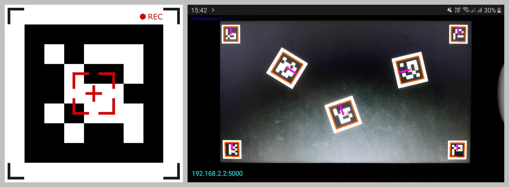
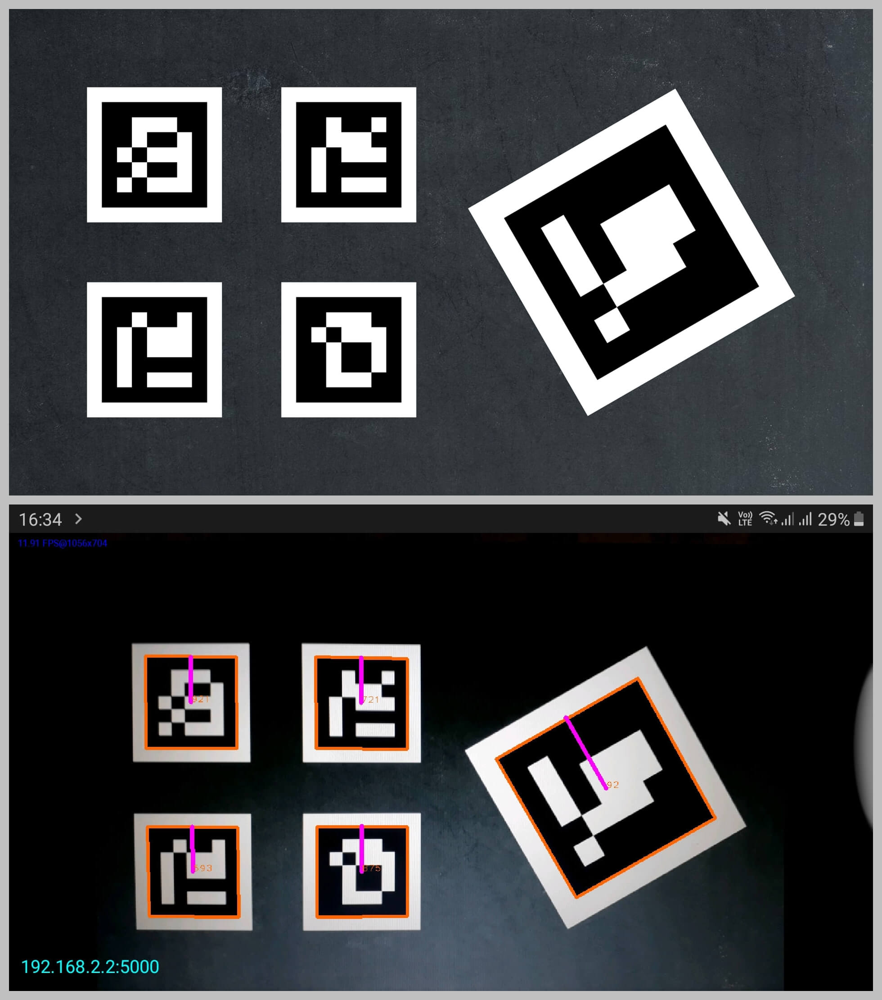

# v1.0

### A simple ArUco marker detector that tracks fiducial markers using the IP Webcam Android application, OpenCV and the ar_markers 0.5.0 Python package.

IP Webcam app -


Detection of ArUco markers -


---

### Using ArUco-Scanner-v1.0

From the command line, execute the following:

```bash
# Clone this repository
$ git clone https://github.com/Soumik-Dhar/ArUco-Scanner-FYP-2020.git/
```
```bash
# Go into the repository
$ cd ArUco-Scanner-FYP-2020/v1.0/
```
```bash
# Install dependencies
$ pip install opencv-python
$ pip install ar-markers
```
```bash
# Generate ArUco markers
# (replace N with the number of markers you wish to generate)
$ ar_markers_generate.py -g N
```

Launch the IP Webcam app and start the vision server.

Replace the value of the ```address``` string in ```detectArUco.py``` with the IPv4 address obtained from the IP Webcam server.

```bash
# Detect ArUco markers
$ python detectArUco.py
```

---

# v2.0

### A more effective and robust ArUco marker detector application (compared to v1.0) built using OpenCV.

The ArUco Scanner application -


ArUco Scanner solves the latency issues caused by the IP Webcam detector (v1.0). Instead of capturing the video feed, compressing it, sending over a Wi-Fi network, decompressing it and then processing the feed on a PC/laptop, ArUco Scanner does all the heavy lifting from within the app itself.

Marker detection using the ArUco Scanner app -


Using OpenCV and the aruco library, the Android application computes the marker ID, size, center and corner coordinates and the heading (in radians) - all inside the app itself. It then sends this data in the form of a JSON response to the PC/laptop (thus relieving the client of these computational overheads).

The server sits on port 5000. The character 'g' needs to be encoded with the request to get the appropriate response.

``` bash
# A sample JSON response from the ArUco Scanner server
{
  "aruco": [
    {
      "ID": 532,
      "center": {
        "x": 266,
        "y": 259
      },
      "heading": -3.1780833783095143,
      "markerCorners": [
        {
          "x": 129,
          "y": 125
        },
        {
          "x": 396,
          "y": 129
        },
        {
          "x": 402,
          "y": 381
        },
        {
          "x": 137,
          "y": 401
        }
      ],
      "size": 267
    }
  ]
}
```

**_This repository has been forked from [eziosoft/ArucoAndroidServer](https://github.com/eziosoft/ArucoAndroidServer.git)_**
